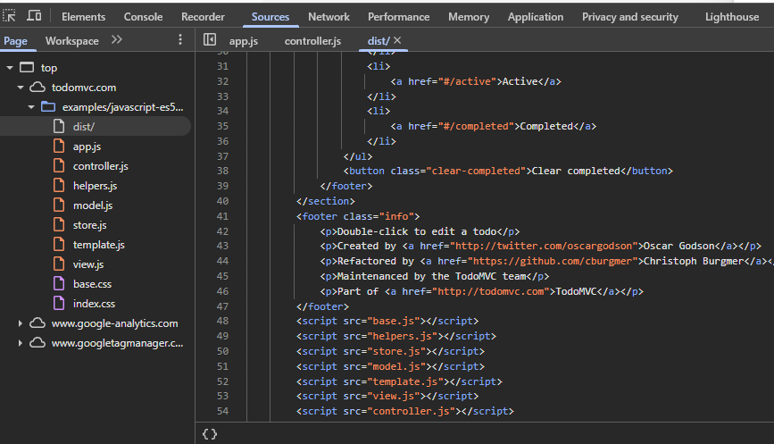
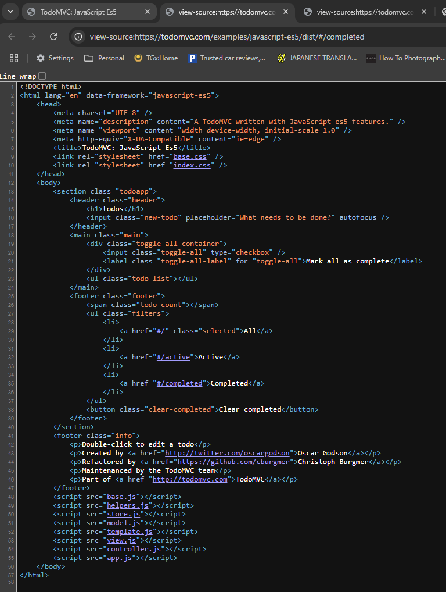

# Chapter 2 - What Will We Automate
The application that we are going to be testing and automating throughout this course is TodoMVC.
You can find it online at [todomvc.com](http://todomvc.com)

To clear local storage of a web app we can do so by right clicking highlighted area and clicking clear!
[image.png](assets/image.png)

### Single Page Application

An application that does not need to reload the page from the server

### Sources tab in dev tools

The source code of the application including HTML, JavaScript and CSS

### "View Source" in the browser

The code provided by the server when the application loads

