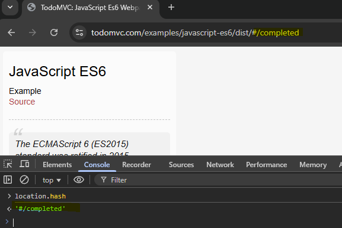

# Chapter 4 - Interacting with App from Console

## 4.1 - Simple Event Sequences

### Click events

All tested on todomvc.com

````javascript
// TOGGLE ALL TO DOs
document.querySelector("#toggle-all").click()
// OR
document.getElementById("toggle-all").click()

// TOGGLE TO DO
// Clicking 3rd checkbox in the list
document.querySelector("ul.todo-list li:nth-child(3) input").click()
//OR
document.querySelector("ul.todo-list > li:nth-child(3) input.toggle").click()

// DELETE TO DO
// delete button for a list element
document.querySelector("ul.todo-list > li:nth-child(3) button.destroy").click()

// CLEAR COMPLETED
document.querySelector("button.clear-completed").click()

// FILTERS
// all
document.querySelector("body > section > footer > ul > li:nth-child(2) > a")
// OR
document.querySelector("ul.filters > li:nth-child(1) > a")

// active
document.querySelector("ul.filters > li:nth-child(2) > a")

// completed
document.querySelector("ul.filters > li:nth-child(3) > a")

````

### hashchange event

The hashchange event is fired when the fragment identifier to the URL. has changed.

Can be checked in the console with `location.hash`



These can be triggered in the console to change the URL

````javascript
location.hash = "/"

location.hash = "/completed"

location.hash = "/active"
````

## 4.2 - Complex Event Sequences

### Inputs

Getting the element
```javascript
document.querySelector("body > section > header > input");
//OR
document.querySelector("input.new-todo");
```

Typing some text
```javascript
document.querySelector("input.new-todo").value="Test1";
```

Then we need to trigger the event


```javascript
document.querySelector("input.new-todo").dispatchEvent(new Event('change', {'bubbles': true}));
```
`'bubbles':true` means the event gets sent to the element and anything up the hierarchy - which is what would happen if the user hits the return key

combination 
```javascript
document.querySelector("input.new-todo").value="Test1";
document.querySelector("input.new-todo").dispatchEvent(new Event('change', {'bubbles': true}));
```

A loop to do it multiple times for some test data
```javascript
for(let i = 1; i <= 20; i++){
    document.querySelector("input.new-todo").value="Test - "+i;
    document.querySelector("input.new-todo").dispatchEvent(new Event('change', {'bubbles': true}));
}
```

Changing an element value
```javascript
// get the value of the label
let stringValue = document.querySelector("ul.todo-list > li:nth-child(1) label").textContent;

//Double-click on the label of the first element in the list
document.querySelector("ul.todo-list > li:nth-child(1) label").dispatchEvent(new Event('dblclick', {'bubbles': true}));

// set the new value to be the old value + "amended"
document.querySelector("ul.todo-list > li:nth-child(1) .edit").value = stringValue + " - amended";

// display the 'blur' event
document.querySelector("ul.todo-list > li:nth-child(1) .edit").dispatchEvent(new Event('blur', {'bubbles': true}));
```


Testing my knowledge - I want to update each element to have " - amended" at the end.
````javascript
const elements = document.querySelectorAll('ul.todo-list li');
const count = elements.length;
console.log("Count:" + count);

for(let i = 1; i <= count; i++){
    let stringValue = document.querySelector("ul.todo-list > li:nth-child("+i+") label").textContent;
    
    //Double-click on the label of the first element in the list
    document.querySelector("ul.todo-list > li:nth-child("+i+") label").dispatchEvent(new Event('dblclick', {'bubbles': true}));

    // set the new value to be the old value + "amended"
    document.querySelector("ul.todo-list > li:nth-child("+i+") .edit").value = stringValue + " - amended";

    // display the 'blur' event
    document.querySelector("ul.todo-list > li:nth-child("+i+") .edit").dispatchEvent(new Event('blur', {'bubbles': true}));
}
````


## Quiz
**1. Which of the following statements is true?**
   We can simulate events using JavaScript to make things happen in the browser
  
**2. To trigger a click event in the browser we:**
   Call the 'click' function directly on the Web Element
  
**3. The Event Listeners tab in the developer tools show us:**
   The events that have code associated with them for a specific Web Element
   
**4. Which of the following are true about triggering a 'change' event?**
   we cannot call 'change' as a function
   we have to use dispatchEvent to trigger a change event
   a change event should be set to 'bubble' to trigger all associated events on the page

**5. When investigating complex event sequences we have to:**
   investigate the sequence of actions in the Elements view and simulate the effects in code
  
**6. How do we learn the correct code to trigger specific events?**
   search the web and research code samples

**7. To make CSS selector queries shorter and more efficient:**
   manually amend them in the console, checking the results to make sure they work
  