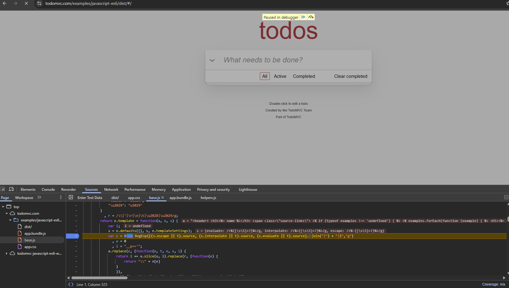

# Snippets View

Doesn't have as much code completion as the console.

Breakpoints can also be added here

This can also be used to debug websites, nothing is private once loaded in the browser!!!

**NB you have to run the snippet to its accessible from the console**