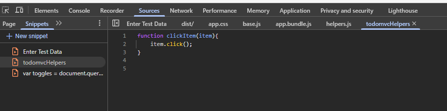

# Chapter 8.1 JavaScript Functions - Helpers

Define a function in a snippet



Use it from the console


Example functions from transcript that need to be tested against current version

```javascript

function clickItem(item) {
    item.click();
}

function toggleAll() {
    document.querySelector('#toggle-all').click();
}
```

# Chapter 8.2 JavaScript Functions - autoTodoObject

Define some functions in a snippet - this is useful as if the website has functions with the same name defining functions that aren't in an object can overwrite them.

```javascript
var autoTodo = new function() {

    this.clickItem = function(item) {
        item.click();
    }

    this.toggleAll = function() {
        document.querySelector('#toggle-all').click();
    }

    this.selectItemX = function(x) {
        document.querySelector("ul.todo-list > li:nth-child(" + x + ") input.toggle").click()
    }

    this.deleteItemX = function(x) {
        document.querySelector('ul.todo-list > li:nth-child(' + x + ') button.destroy').click()
    }

    this.clearCompleted = function() {
        document.querySelector('button.clear-completed').click();
    }

    this.filterCompleted = function() {
        location.hash = "/completed";
    }

    this.filterAll = function() {
        location.hash = "/";
    }

    this.filterActive = function() {
        location.hash = "/active";
    }
    
    this.createTodo = function(name) {
        document.querySelector('input.new-todo').value = name;
        document.querySelector('input.new-todo').dispatchEvent(new Event('change',{
            'bubbles': true
        }));
    }

    this.amendTodo = function(x, amendedValue) {
        document.querySelector('ul.todo-list > li:nth-child(' + x + ') > div > label').dispatchEvent(new Event('dblclick',{
            'bubbles': true
        }));
        document.querySelector('ul.todo-list > li:nth-child(' + x + ') .edit').value = amendedValue;
        document.querySelector('ul.todo-list > li:nth-child(' + x + ') .edit').dispatchEvent(new Event('blur'));
    }

}
```

Can then be run from the console with commands like:
`autoTodo.clickItem(document.querySelector('.toggle-all-label'));`
