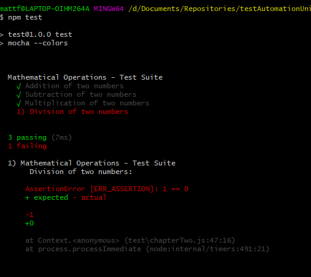

# Chaper 2 - Function Calls
Mocha comes pre-bundled with two function calls

`describe()` - A simple way to group our tests in Mocha.

It provides us a feature to create a series of tests. In general, the `describe()` function takes 2 arguments. The first is the name or description of the test group and the second one is the callback `function`, which is a function that needs to be executed after another function has finished executing.

`it()` - A way to describe the individual test cases.

These tests should be nested within the `describe()` block. `it()` function should be described in a way that it makes sense for the given test case.

In this example, you will be able to see the basic syntax of `describe()` and `it()` functions.

To add output colours in git bash you can add the `--colors` argument in the `package.json` file.

````json
"scripts": {
    "test": "mocha --colors"
  }
````
In order to execute the tests we run
``npm test``



The tests need to be located in a folder called `test`
