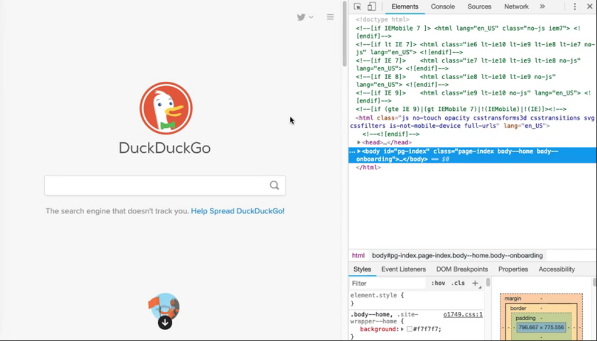

# Chapter 3 - Finding Live Web Elements
To open DevTools, simply right click anywhere on the page and select "inspect".



To visually pinpoint an element, click the "select" tool in the upper left corner of the DevTools pane.
It should look like a square with a cursor on it. When you click it the icon should turn blue.

The corresponding HTML source code in the elements tab will also be highlighted.


Writing good locators can be challenging. Remember, a locator will return all elements that match its query.

If a locator is too broad, then it could return false positives.
However, if a locator is too specific, then it could break whenever the DOM changes and it could also be difficult for others to read.

### ID
IDs are the best types of locators.
By HTML standards, the `id` attribute must have a unique value on a given page. Thus, a locator that uses an idwill uniquely identify a single target element.
Whenever I need to write a locator, the first thing I look for is an id attribute. If the element has one, then my locator is super simple. Just make sure that the id is, in fact, used uniquely on the page. A simple DevTools source search can validate that.

JavaScript example
````javascript
document.getElementById("search_form_input_homepage");
````
Java example
````java
driver.FindElement(By.id("search_form_input_homepage"));
````
### Name
Another good locator is the `name` attributes.

JavaScript example
````javascript
document.getElementByName("q");
````
Java example
````java
 driver.FindElement(By.name("q"));
````

### Class
A third basic locator is CSS class name.
Class names attach CSS styling to HTML elements. However, they can also double as defacto identifiers. An element may have one class name, many class names, or none at all.
Furthermore, class names do not need to be unique per element. One class name could be shared by multiple elements. This is useful when locating a set of elements, such as a list of search results.

JavaScript example
````javascript
document.getElementByClassName("result");
````
Java example
````java
 driver.FindElement(By.className("result"));
````

## Resources
[Chrome DevTools](https://developers.google.com/web/tools/chrome-devtools/)
[Web Element Locators for Test Automation](https://automationpanda.com/2019/01/15/web-element-locators-for-test-automation/)
[HTML name Attribute](https://www.w3schools.com/tags/att_name.asp)

## Quiz
HTML Document for Quiz Questions 6-9
````html
<html>
<body>
<div class="article opinion" id="main-article">
    <div class="section">
        <h2 class="topic-header">Main Argument</h2>
        <p>...</p>
    </div>
    <div class="section">
        <h2 class="topic-header">Rebuttal</h2>
        <p>...</p>
    </div>
    <div class="section">
        <button class="response-button" name="agree">Agree with Argument</button>
        <button class="response-button" name="disagree">Agree with Rebuttal</button>
    </div>
</div>
</body>
</html>

````

1. **How can you look at the source code, network activity, and other information for a live web page in Google Chrome?**

   Right-click anywhere on the page and select "Inspect".
   Navigate from the three-dot menu to "More Tools" > "Developer Tools".

2. **"Name" locators only work for `<input>` tag elements.**

    False

3. **"Class name" locators can return multiple elements.**

    True

4. **You need to write a locator for an element, and you discover that it has an ID. What should you do?**

   Verify that the ID truly is unique on the page, and then use it for the "by ID" locator.

5. **Which would be the best locator for locating this element uniquely (assuming unique attribute values)?** 
    `<input id="first-name-input" name="first-name" class="important-field big-field">`

   `By.id("first-name-input")`

6. **Review the HTML document above. What locator would uniquely target the parent `<div>` element for the article?**

   `By.id("main-article")`
   `By.className("article")`
   `By.className("opinion")`

7. **Review the HTML document above. What locator would uniquely target the "Agree with Argument" button?**
    
    `By.name("agree")`

8. **Review the HTML document above. What locator would return all section header `<h2>` elements?**

   `By.className("topic-header")`

9. **Review the HTML document above. What locator would return the `<p>` paragraph element in the rebuttal section?**

   `By.className("section")`
   `By.name("p")`
   `By.name("section[2] p")`
   **None of the above.**


    